<div style="width: 50%; margin: 0 auto;">

# G064 Herbaria Image Measurement Protocol for MaxEnt (Revised)

#### By Cristopher Ferreon, Kat Tisshaw, Aaron Rhodes, Kaustubh Duddala

Revised July 7, 2026

#

#### Summary

This protocol outlines obtaining georeferenced GBIF herbaria data and measuring associated plant traits in ImageJ to determine the climatic suitability of large and small form Guinea grass using known morphological trait differences. From the dataset acquired using this protocol, we then use the Presence-absence prediction tool (MaxEnt) in ArcPro to estimate the climatic suitability for each taxon using the known locations associated with global climate
patterns.

<details>
  <summary>See Automated Workflow (Revised)</summary>
</details>
<br>
<details>
  <summary>See Manual Protocol (Original)</summary>

#### Contents

### 1. GBIF Download

- Use filters to ensure reliable geographic and taxonomic data

### 2. Data Preparation

- Use multimedia links associated with each occurrence to locate and download high quality images of herbarium vouchers

### 3. Measuring images in ImageJ/ImageJ2/Fiji

### 4. Glossary/Rationales

---

# 1. GBIF Download

### 1.1 Access this url on your web browser:

- [https://www.gbif.org/](https://www.gbif.org/)

### 1.2 type a species name in the search bar, and select occurrences

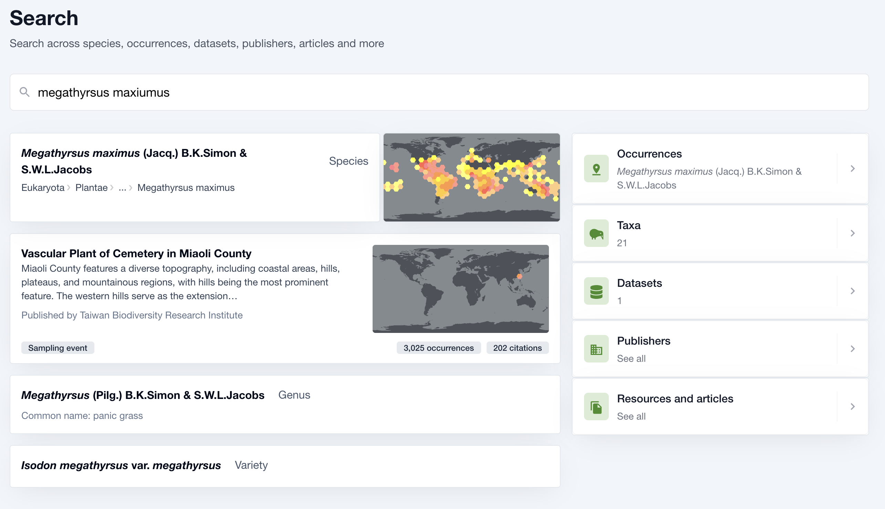

### 1.3. Apply the following filters

- Occurrence Status: Present
- Basis of Record: Preserved Specimen
- Location:
  - Has Coordinate: Yes
- Issues and Flags (_Italics_ indicate inspection ideal):
  - Coordinate reprojected
  - _Country mismatch_
  - Country invalid
  - Country derived from coordinates
  - Continent invalid
  - Continent derived from coordinates
  - _Recorded date mismatch_
  - _Recorded date invalid_
  - _Recorded date unlikely_
  - _Taxon match fuzzy_
  - _Taxon match higherrank_
  - Scientific name ID not found
  - _Taxon concept ID not found_
  - _Taxon ID not found_
  - Elevation min/max swapped
  - Elevation non numeric
  - Modified or Identified date invalid
  - Type status invalid
  - _Multimedia date invalid_
  - _Multimedia URI invalid_
  - _Individual count conflicts with occurrence status_
  - _Occurrence status unparsable_
  - Occurrence status inferred from individual count
  - Ambiguous institution
  - Ambiguous collection
  - Institution or Collection match none
  - Institution or Collection match fuzzy
  - Institution collection mismatch

> **Do NOT include the following** as these all indicate unreliable geospatial data:
>
> - Coordinate rounded
> - Geodetic datum invalid
> - Geodetic datum assumed WGS84
> - Coordinate precision invalid
> - Coordinate uncertainty in metres invalid
> - Any footprint invalid/mismatch
> - Continent [or country] coordinate mismatch
> - Continent country mismatch

### 1.4. Download the Data

#### 1.4.1. Select a download format in the **Download** tab

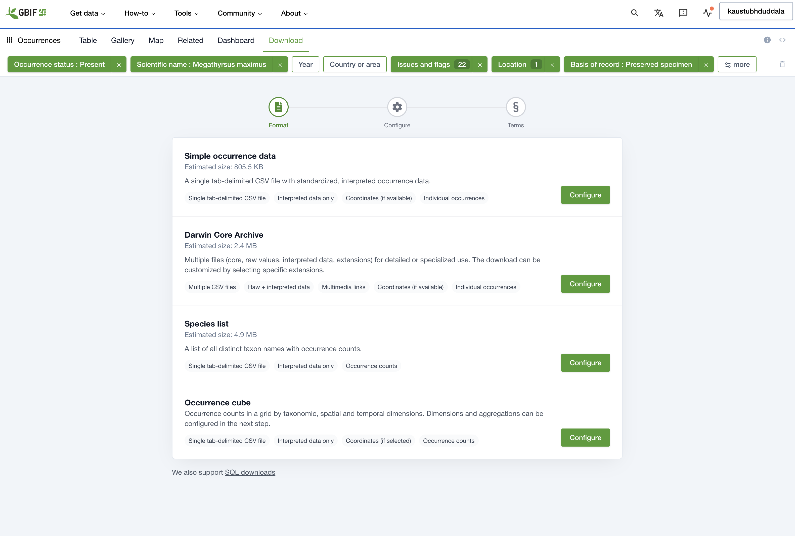

#### 1.4.2. Configure extension options

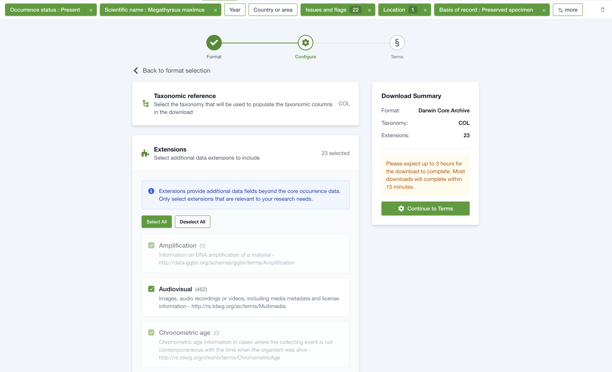

#### 1.4.3. Agree to terms

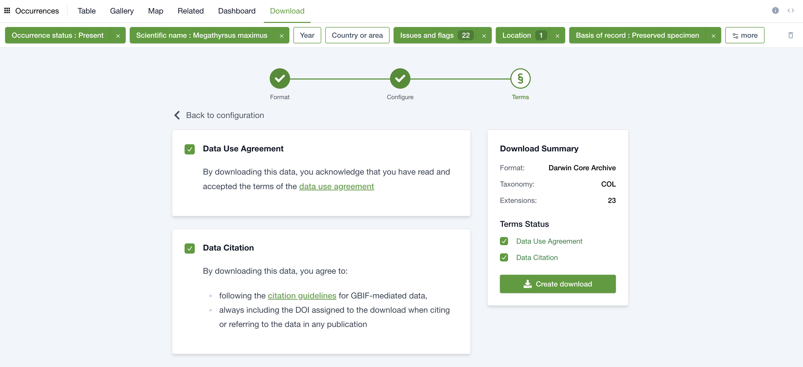

#### 1.4.4. Create Download

> Expect up to 3 hours for the download to complete. Most downloads will complete within 15 minutes

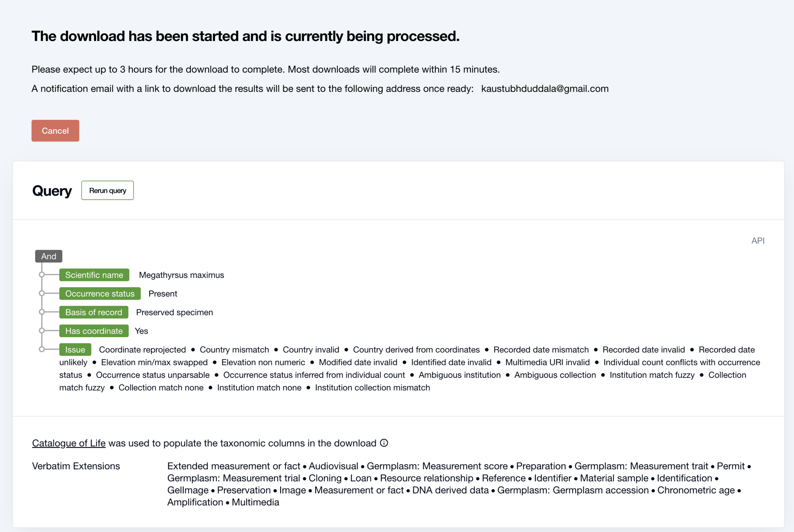

#

# 2. Data Preparation

The following protocol references the GBIF download for Megathyrsus maximus (Jacq.)
B.K.Simon &amp; S.W.L.Jacobs: GBIF.org (7 January 2026) GBIF Occurrence, [https://doi.org/10.15468/dl.u4hgm5](https://doi.org/10.15468/dl.u4hgm5)

The GBIF download includes a zipped file containing txt files and browser html links

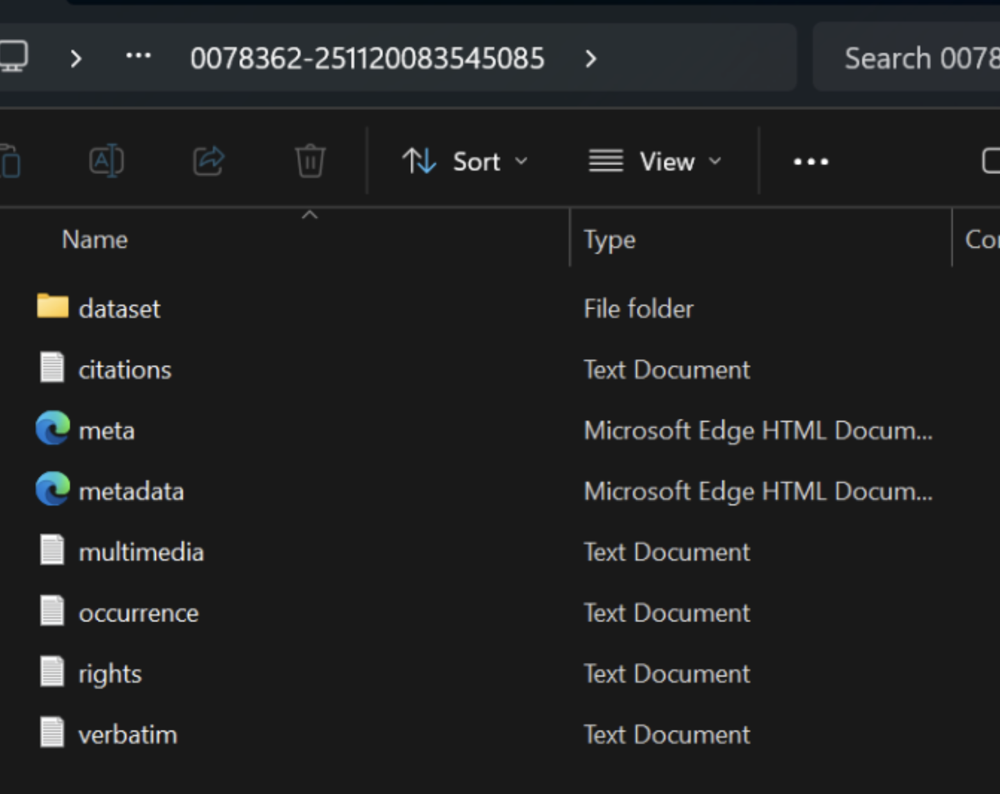

### 2.1. Data Cleaning

Use the R script below to link the two .csv spreadsheets “multimedia” and “occurrence” and perform other data cleaning for the project You'll end up with two spreadsheets, one will contain occurrences removed from the “master” because of duplicated coordinates. This spreadsheet will be processed after the master is finished, to backfill any occurrences where vouchers could not be accessed and measured.

### 2.1.1. R Script by Kat Tisshaw

<details>
  <summary>Click to show R code</summary>

```
library(tidyverse)
library(CoordinateCleaner)

gbif_db = read.csv(file.choose()) #choose the "01-06-2025_occurrence.csv" file
media_db = read.csv(file.choose()) #choose the "01-06-2025_multimedia.csv" file

# within the multimedia spreadsheet, you need to first update the names of columns with "_multimedia" because these column names are
#exactly the same in the occurrence spreadsheet, but they have different contents.
media_db <- rename(media_db, type_multimedia = type, references_multimedia = references, publisher_multimedia = publisher,
                   license_multimedia = license, rightsHolder_multimedia = rightsHolder)

#remove any columns that only have NAs (this is only to make the spreadsheet easier to parse through)
gbif_db <- gbif_db %>%
  select(where(~ !all(is.na(.))))

#join multimedia spreadsheet to gbif occurrence
master_df <- media_db %>%
  full_join(gbif_db, by = c("gbifID"))

#filtering the spreadsheet to only have latitudes and longitudes with 3 decimal places:
master_df <- master_df[grep("\\.[1-9][1-9][1-9]", master_df$decimalLatitude), ]
master_df <- master_df[grep("\\.[1-9][1-9][1-9]", master_df$decimalLongitude), ]

#Check all entries in the scientific names and infraspecific epithet columns. Please note that sometimes the variety is in scientificName but
#not infraspecific epithet, and vice versa. This means that if you're concerned with subspecies, you'll really need to observe the entries in
#both columns and be careful that any aren't kept or removed erroneously.
unique(gbif_db$scientificName)
unique(gbif_db$infraspecificEpithet)

#removed occurrences with the following scientificName:
master_df <- master_df %>%
  filter(!scientificName %in% c("Megathyrsus maximus var. coloratus (C.T.White) B.K.Simon & S.W.L.Jacobs",
                                "Megathyrsus maximus var. pubiglumis (K.Schum.) B.K.Simon & S.W.L.Jacobs",
                                "Panicum compressum Biv.",
                                "Panicum trichoglume K.Schum.",
                                "Panicum maximum var. effusum A.Camus",
                                "Panicum mahafalense A.Camus",
                                "Panicum maximum var. pubiglume K.Schum",
                                "Panicum maximum var. trichoglume Robyns"))

#Adjust this code acccording to available infraspecific epithets we don't want
master_df <- master_df %>%
  filter(!infraspecificEpithet %in% c("Megathyrsus maximus var. coloratus (C.T.White) B.K.Simon & S.W.L.Jacobs",
                                      "Megathyrsus maximus var. pubiglumis (K.Schum.) B.K.Simon & S.W.L.Jacobs",
                                      "Panicum compressum Biv.",
                                      "Panicum trichoglume K.Schum.",
                                      "Panicum maximum var. effusum A.Camus",
                                      "Panicum mahafalense A.Camus",
                                      "Panicum maximum var. pubiglume K.Schum",
                                      "Panicum maximum var. trichoglume Robyns"))
#Adjust this code acccording as well
master_df <- master_df %>%
  filter(!verbatimScientificName %in% c("Megathyrsus maximus var. coloratus (C.T.White) B.K.Simon & S.W.L.Jacobs",
                                      "Megathyrsus maximus var. pubiglumis (K.Schum.) B.K.Simon & S.W.L.Jacobs",
                                      "Panicum compressum Biv.",
                                      "Panicum trichoglume K.Schum.",
                                      "Panicum maximum var. effusum A.Camus",
                                      "Panicum mahafalense A.Camus",
                                      "Panicum maximum var. pubiglume K.Schum",
                                      "Panicum maximum var. trichoglume Robyns"))

#clean data using the wrapper function for all three tests
master_df <- clean_coordinates(
  x = master_df,
  lon = "decimalLongitude",
  lat = "decimalLatitude",
  species = "species", #species column is needed for some functions - not sure if it's needed for mine here but added anyways
  tests = c("centroids", "seas","institutions"),
  value = "clean") #returns a data frame with problematic records removed

unique(master_df$issue)

#these are all related to unreliable geospatial data:
bad_issues <- c("COORDINATE_ROUNDED",
                "GEODETIC_DATUM_INVALID",
                "GEODETIC_DATUM_ASSUMED_WGS84",
                "COORDINATE_PRECISION_INVALID",
                "COORDINATE_UNCERTAINTY_METERS_INVALID",
                "FOOTPRINT_INVALID",
                "FOOTPRINT_WKT_MISMATCH",
                "CONTINENT_COORDINATE_MISMATCH",
                "COUNTRY_COORDINATE_MISMATCH",
                "CONTINENT_COUNTRY_MISMATCH")

#removes any occurrences with the unreliable geospatial data "bad_issues":
master_df <- master_df %>%
  filter(is.na(issue) | !str_detect(issue, str_c(bad_issues, collapse = "|")))

unique(master_df$issue)

inspect_issues <- c("COUNTRY_MISMATCH",
                    "RECORDED_DATE_MISMATCH",
                    "RECORDED_DATE_INVALID",
                    "RECORDED_DATE_UNLIKELY",
                    "OCCURRENCE_STATUS_UNPARSABLE")

master_df <- master_df %>%
  mutate(inspect_flag = if_else(!is.na(issue) &
                                  str_detect(issue, str_c(inspect_issues, collapse = "|")), TRUE, FALSE))
#Export for manual inspection:
write.csv(master_df,"GBIFdownload_inspectFlags.csv") #Prior to inspecting rows, sort by Coordinate Uncertainty and
#remove any occurrences over 5000m UNLESS precision is specified (and is a very small number). Create a notes column and
#enter 'Remove' in rows where there are suspicious collections like "cultivated" or "botanic gardens" in the locality
#column. Check other columns by using the Excel Data filter to get a list to scroll through (as I've noticed with other
#GBIF data, data entries aren't always correct and notes are put in the wrong columns). Finally, inspect the occurrences
#that are marked as TRUE in the inspect_flag column, add 'Remove' to notes if anything warrants removing.

#reload spreadsheet:
master_df = read.csv(file.choose(), na.strings = "") #choose the updated "GBIFdownload_inspectFlags.csv" file

#remove any columns flagged as "Remove"
master_df <- master_df %>%
  filter(is.na(Action) | Action != "Remove")

master_df_ND <- master_df %>%   #ND for no duplicates
  distinct(decimalLatitude, decimalLongitude, .keep_all = TRUE)

removed_coords <- master_df %>%
  group_by(decimalLatitude, decimalLongitude) %>%
  filter(n() > 1) %>%      #take only duplicated coordinate groups
  slice(-1) %>%            #remove the first of a set that is duplicated from this df
  ungroup()

#code to remove any columns that only have NAs:
removed_coords <- removed_coords %>%
  select(where(~ !all(is.na(.))))

write.csv(removed_coords,"01-06-2025_DuplicateRecordsRemovedfromMaster.csv")

write.csv(master_df_ND,"01-06-2025_master.csv")


#exported, changed to .xls file, and did further cleaning which required inspecting spreadsheet and removing occurrences that did not have a
#valid entry for ANY of the following columns:
# “identifier”
# “references[_multimedia]”
# “bibliographicCitation”
# “references”
# “associatedReferences”
# "occurrenceID"
```

</details>

### 2.2. Add Relevant Columns & Data

Using the master spreadsheet, create new columns for your measurements:

- Panicle length (cm)
- Leaf width (cm)
- Seed length (cm)

For readability, highlight the main columns that will be used to find the links to the vouchers to be measured, including:

- identifier
- biblographicCitation
- references_multimedia
- references
- associatedReferences
- occurenceID

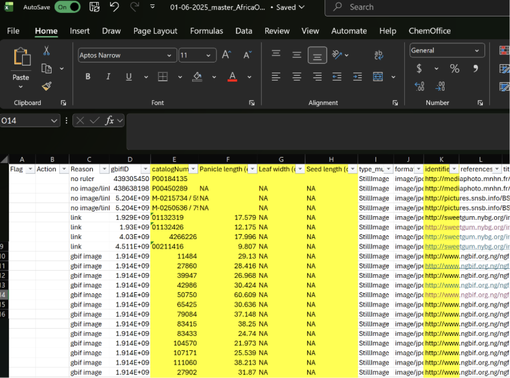

> Note: For this specific download, the 6 columns noted above each had at least one occurrence row where a valid link to the herbaria voucher specimen was found only within one of those columns, but this does not mean that in future downloads this is relevant; there may be more or less depending on your search criteria. Any other highlighted columns within the spreadsheets on Box are referenced while processing the data (catalog number, panicle length, leaf width, and seed length).

Once the datasheet is set up, you will need to find images of the preserved specimens and upload them to a separate folder on your desktop. For each occurrence (specimen/image), first try searching up the link in the datasheet: this can be done quickly by double clicking the link in the “identifier” column, then clicking out and back on the link, which should turn blue after clicking out. If this does not work, copy and paste the link into the internet search bar.

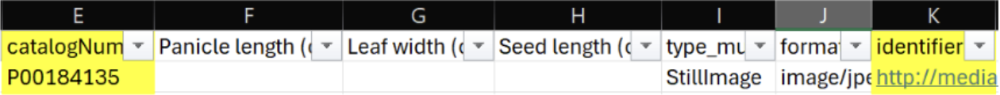

> Alternatively, if the link **does not** work, you can return to your GBIF browser (with the search filters still intact from the previous section) and search for the specific occurrence using the catalog number pasted into the “Search all fields” bar in the GBIF Occurrence Search. A single result should pop up; if there are multiple results, click the topmost option and check that the catalog number under the “Occurrence” heading matches.
> 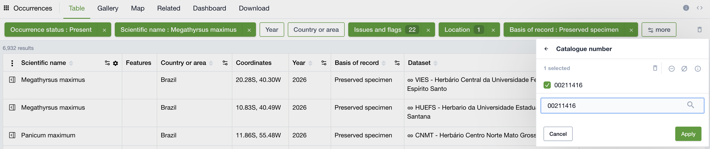
> 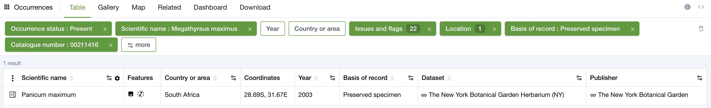
> After clicking on the occurrence result, you should find image(s) of the sample. If not, or the image is unusable (not a preserved specimen, unclear image, etc.), mark this down on the datasheet and continue to the next occurrence row.
> 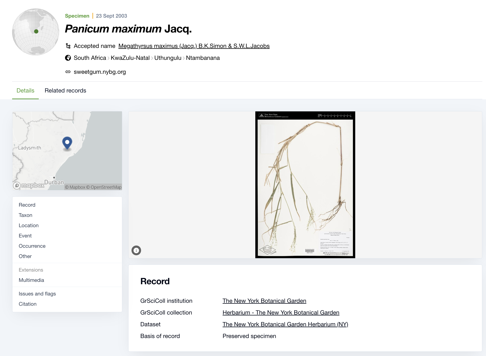

Save the images into your computer’s designated folder. Within that folder, you can name each of the images by their catalog number to find them more easily.

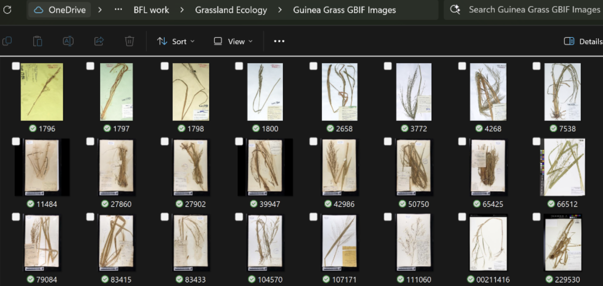

#

# 3. Measuring images in ImageJ/ImageJ2/Fiji

Once you have uploaded the images into a designated folder, you can begin measuring them in ImageJ. [Reference this protocol if you have not downloaded or are not familiar with working in the ImageJ program](https://docs.google.com/document/d/1JSynXUCMSiwbqj4g4KALTdQ_guGFojMC/edit). Alternatively, you may be able to use [ImageJ2](https://imagej.net/software/imagej2/) or [Fiji](https://imagej.net/software/fiji/) as they are just alternative versions of ImageJ.

### 3.1. Load in Images into ImageJ

Once you open ImageJ/ImageJ2/Fiji, you should see an empty interface window. Click “File” in the top left corner, select “Import,” and then click “Image Sequence.” A window should pop up; click “Open” in the bottom right corner to be directed to your computer files.

From this, navigate to your designated folder and find the image you are looking for, either by scrolling through the images or by looking up the image name.

> Note: It’s helpful to have named the images by their catalog numbers, so you are able to copy and paste the number to quickly find the image.

Once the image is open in ImageJ:

- if the image contains a visible ruler or scale bar, continue to **Calibrate Herbaria Sheet with scale** step. (3.2a)
- If there is no scale bar but the full paper sheet visible and appears to be standard size, assume the sheet width is the standard size of 29cm; continue to the Calibrating Herbaria sheet with no scale step. (3.2b)
- If the full paper sheet is not visible or sheet dimensions look off, do not take measurements, mark all traits as NA and note “no scale” or anything else applicable.

### 3.2a. Calibrate Herbaria Sheet with Scale

Using the “Straight Line” tool, which you can find by right clicking the 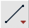 icon, measure the ruler:

1. Zoom in to a small section of the ruler
2. Click and drag using the line tool from one hatch mark to the next
   - Note the units of measurement and make the line as straight as possible.

In the image below, one centimeter of the ruler is being measured.

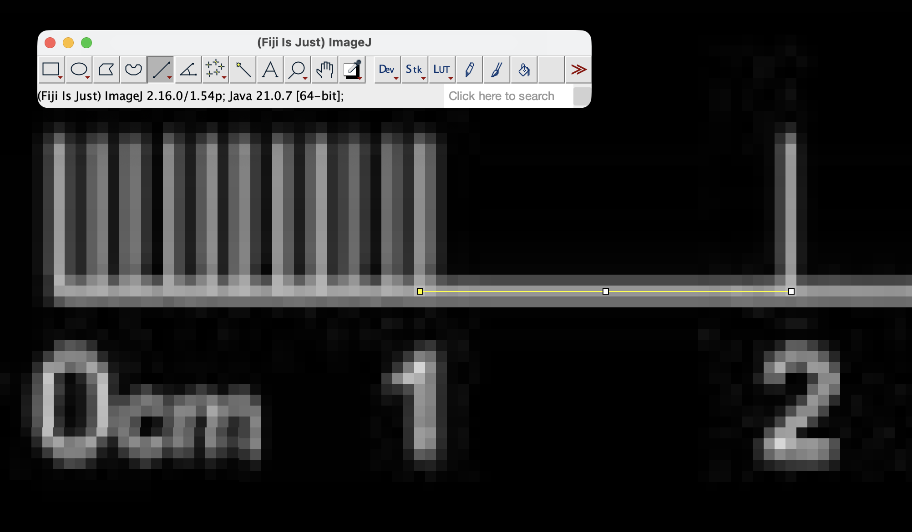

> Tip: Hold the shift key while dragging the line tool to make sure the line stays straight.

After the line is made, click the “Analyze” tab on the ImageJ window, then select the “Set Scale” tab.

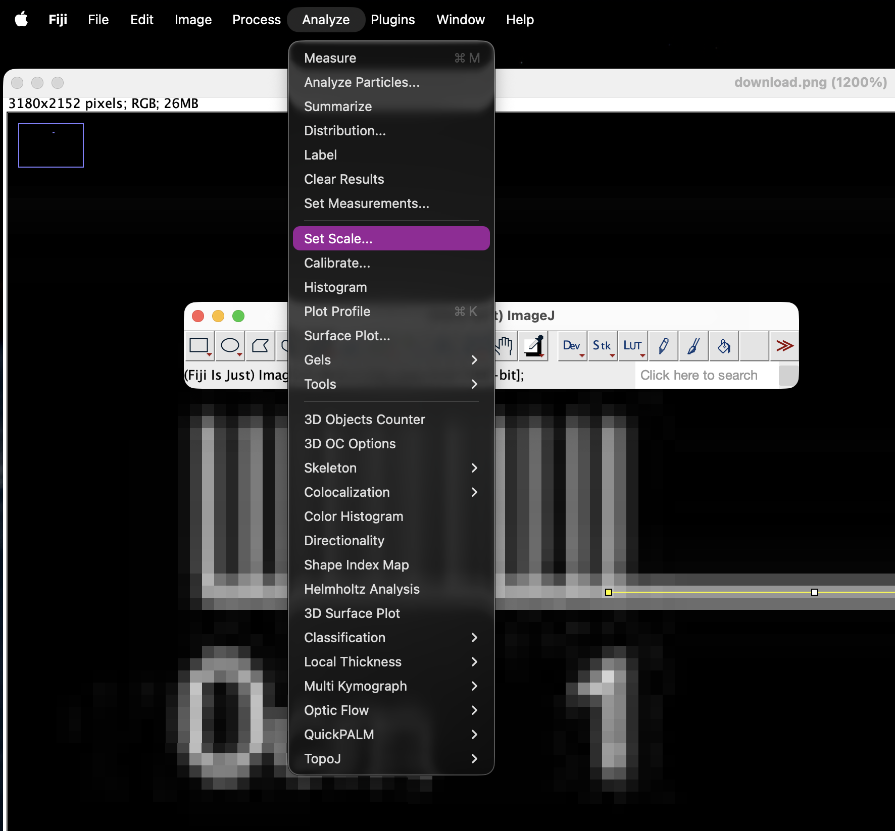

Once the new tab appears, change the known distance to 1. You may change the unit of length to match the desired units (in this case cm), but it is not necessary. Click OK to confirm the scale input. In the example, the scale has now been set to 34 pixels per 1 cm distance.

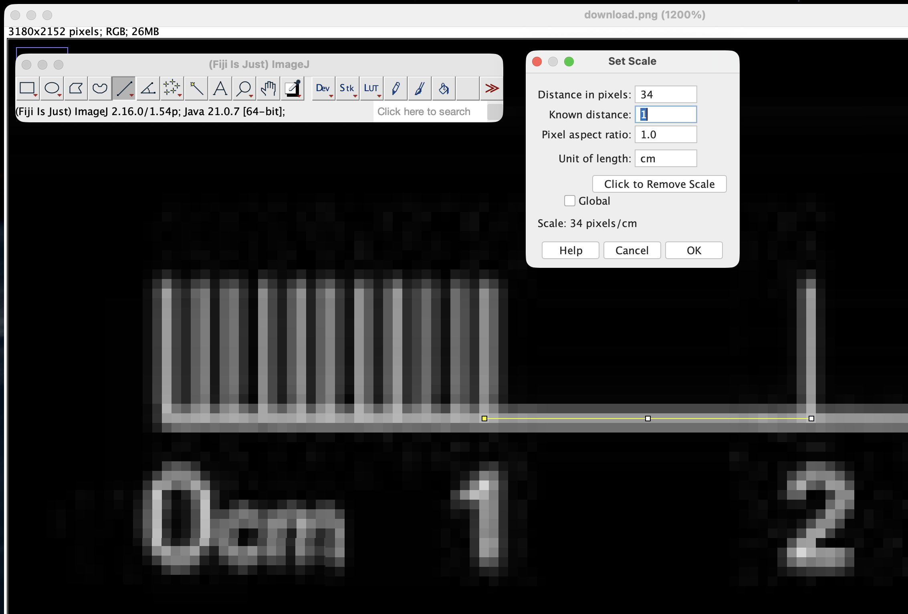

### 3.2b. Calibrate Herbaria Sheet with no Scale

If the herbaria sheet has no scale bar or ruler, you can still calibrate the image in ImageJ by assuming the standard width of the paper is 29 cm (11 inches).

Following the same instructions as above (3.2a):

1. Use the “Straight Line” tool to measure a line across the full width of the paper.
2. Go to the “Analyze” tab in the top menu bar and select “Set Scale”
3. In the dialog box that appears, enter "29" as the "Known distance" and optionally select "cm" as the "Unit of length." Click "OK" to apply the scale.

### 3.3. Measuring Images of Guinea Grass

#### 3.3.1. Guinea Grass Physiology Reference

The measurements taken are panicle length, leaf width, and seed length. Below are some definitions and images as a reference for Guinea grass physiology.

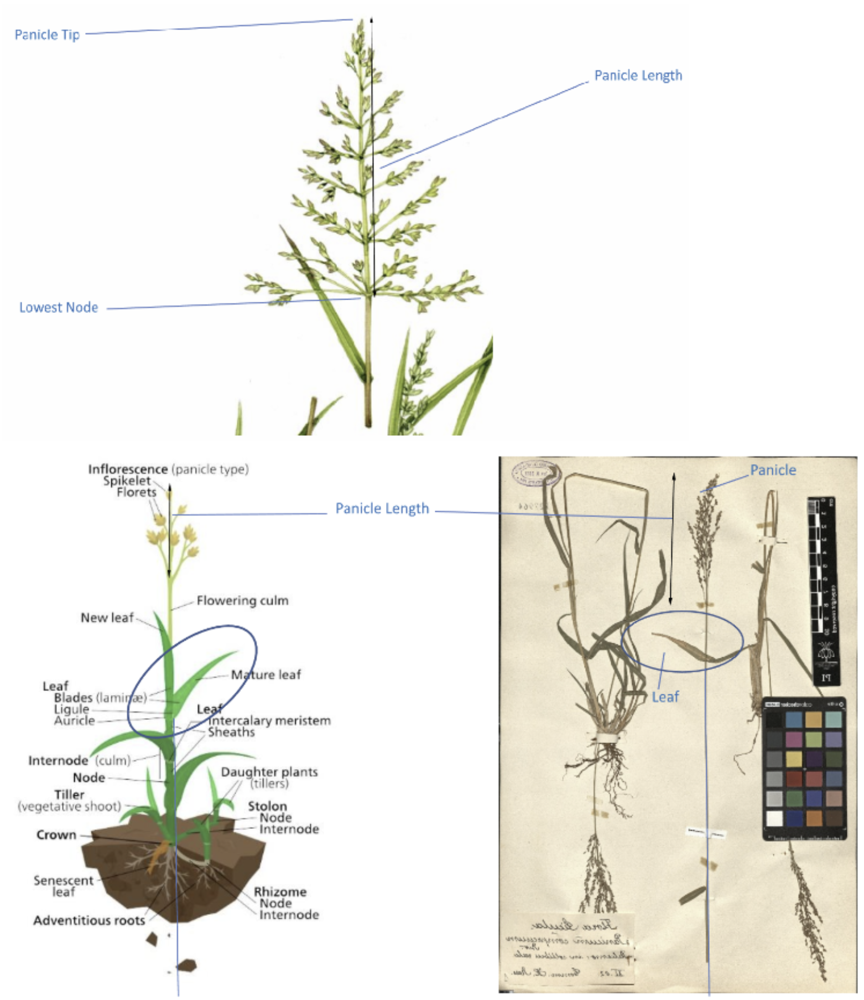

- Panicle length: From the lowest panicle node to the tip of the panicle
  - Panicle: flowering portion of grass
  - Node: a point from which plants branch
- Leaf width: from margin to margin at the widest point of the leaf
  - Margin: the outer edge of a leaf
- Seed length: from the point at which the seed branches out to the tip
  - Seed: each enclosed capsule at the end of each branching point

#### 3.3.2. Measurements in ImageJ/ImageJ2/Fiji

1. In the ImageJ toolbar, switch the line tool to “Segmented Line” by clicking and holding the  icon.

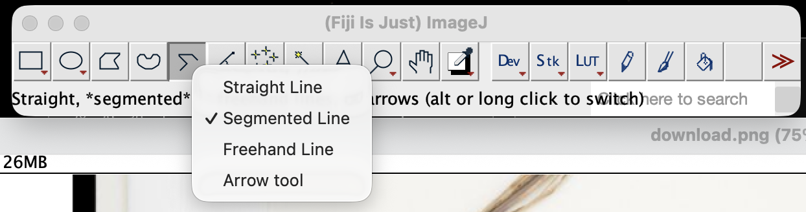

2. For this tool, click to start a line and click again to add a new section of the same line. Trace the structure carefully.
3. To end the segmented line, double click in place at the end of the last measurement.
4. Press Ctrl + M to get the measurement in the desired units under the “Length” label.

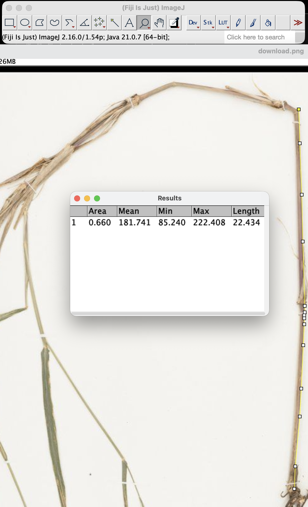

Examples of leaf width and seed length:

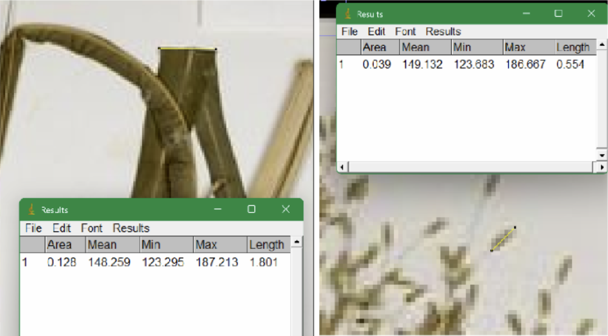

> Note: Make sure that the structures are visible and measurable before recording measurement. If not, record NA in the datasheet for that measurement and add a note explaining why (no leaves/seeds, panicle unseen, image unclear, etc.). Examples of other issues you may encounter, and unmeasurable structures, are outlined below.

#### 3.3.3. Examples of Unclear/Unmeasurable Structures

- If the panicle of a sample is folded or covered, it may be helpful to look at the seeds and estimate where they taper in towards the stem, and measure from there.

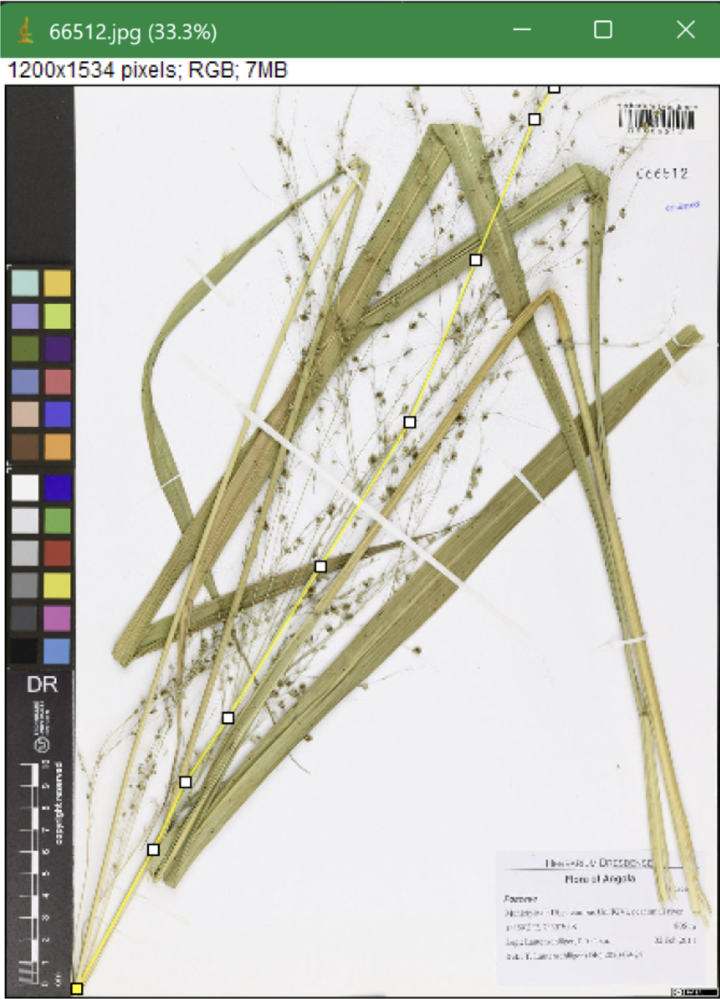

- If a sample specimen does not have any leaves or seeds (or instead has flowers), mark those measurements as NA in the datasheet and make a note.

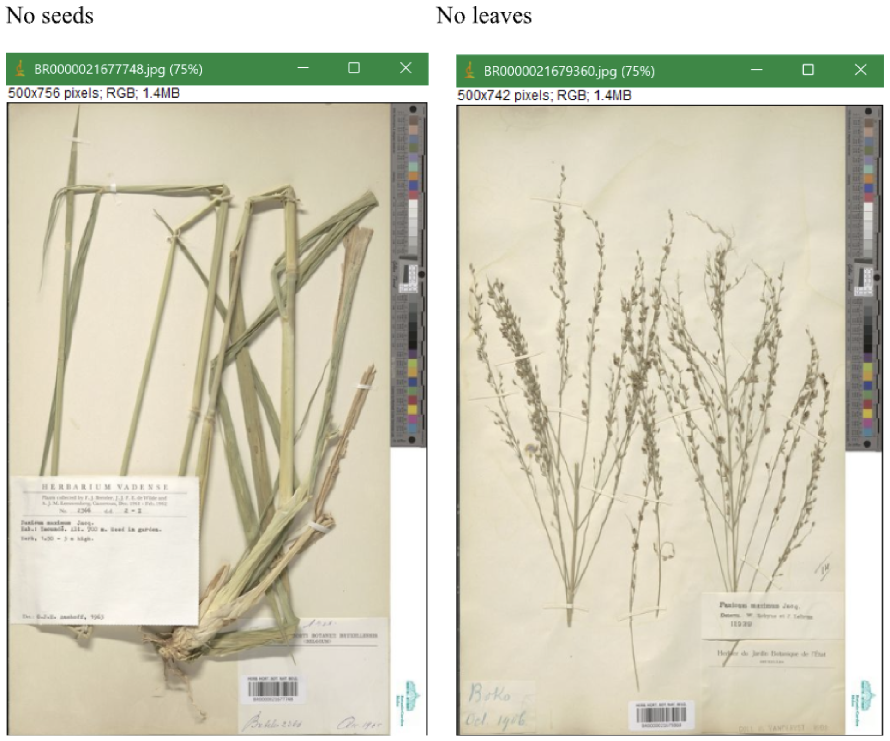

#

# 4. Glossary/Rationales

Documented below is explaiations of why certain flags are generated by GBIF and why certain data records are removed from analyses for our purposes

### 4.1. Basis of Record Categories (Excluded from Search)

Observation: Unspecified observer, could be sensor-based, less metadata than human or machine observation (i.e., older/aggregated datasets, legacy monitoring programs).

Machine observation: Detected by machine (i.e., camera traps, remote sensing).

Human observation: A direct observation by someone without a collection (i.e., from field surveys, notes, or literature). Can’t be confirmed.

Material sample: Physical sample that is not a whole organism (i.e., soil/litter samples with grass, eDNA).

Material citation: A reference to, or citation of, one, a part of, or multiple specimens in publication or field notebook. Can’t be confirmed.

Fossil specimen: Not relevant for contemporary climatic suitability.

Living specimen: A living plant grown intentionally in cultivation (e.g., botanical garden, experimental plots). Not a natural occurrence location, although it could be naturalized/not currently maintained.

Occurrence: Serves as an “NA” for Basis of Record.

### 4.2. Issues and Flags Explanations

Coordinate reprojected: Reprojected successfully to WGS84.

Country mismatch: Interpreted Country [from coordinates?] and Country code contradict each other. Both country and coordinates are reported by the data publisher, and they don’t match; potentially from country/coordinate typo, low coordinate precision, borders/coastal areas, historical/admin change.

Country invalid: Reported country code has a typo or doesn’t match GBIFs code/list (i.e., “West Africa”).

Continent invalid: Reported continent has a typo or doesn’t match GBIF’s list.

Recorded date mismatch, invalid, or unlikely: Typo and/or in the future/before Linnean times, or doesn’t make biological sense (i.e., dinosaur found in 2025). Check, then remove future dates since it indicates a suspicious/messy collection.

Taxon match fuzzy: Typo or alias.

Taxon match higherrank: Typo or alias, but remove records wherein specific species of interest, or variant, is not included.

Scientific name ID not found: Typo or alias.

Taxon concept ID not found: ID formatting errors, recently updated taxon, or mismatch back to Taxon ID.

Taxon ID not found: Typo or alias, but remove when specific species of interest, or variant, is not included.

Elevation min/max swapped: Indicates that it might have been a swapping error (since the min is higher than the max) but could also be a typo. Don’t use if you need elevation data specific to that observation (not relevant for our purposes).

Elevation non numeric: GBIF expects a number (no units), so it automatically flags text or symbols.

Modified or Identified date invalid: Date could be invalid (i.e., future, or day “34”), or not in the correct format.

Type status invalid: Provided specimen type status has typo, formatting error, or is not in GBIF’s list (i.e., holotyp instead of holotype).

Multimedia date invalid: Date could be invalid (i.e., future, or day “34”), or not in the correct format. Check and remove if it’s in the future or historical.

Multimedia URI invalid: For studies measuring traits on herbarium datasheets, this means you won’t be able to access the URL with the herbarium sheet scan. You could try to search for the updated URL through the herbarium database online.

References URI invalid: Reference might have been malformed or have invalid characters.

Individual count conflicts with occurrence status: Consider removing observations where the count is “0” although the occurrence status is “Present”.

Occurrence status unparsable: The value provided is something other than “Present” or “Absent”. Remove any that suggest the specimen was absent.

Occurrence status inferred from individual count: No occurrence status was provided so anything with a count > 0 is classified as “Present”, otherwise it’s classified as “Absent”.

Ambiguous institution: Institution code matches more than one institution in GRSciColl or match was uncertain.

Ambiguous collection: Provided collection code matches multiple collections in GRSciColl.

Institution or Collection match none: No match was found in GRSciColl because it doesn’t exist or code is wrong.

Institution or Collection match fuzzy: A likely but not exact match between a specimen’s institution or collection code/identifier in a dataset and its entry in GRSciColl.

Institution collection mismatch: Provided collection code doesn’t match one listed for the specified institution.

</details>
</div>
